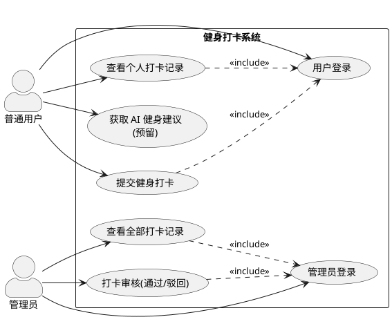

# 需求分析

> 项目：健身打卡系统（JSA）
> 文档版本：v1.0
> 最后更新：2026-06-16

## 1. 项目背景与目标

本系统是一个**健身打卡管理系统**，面向有健身记录与监督需求的场景。用户通过提交运动打卡记录来坚持健身习惯，管理员对打卡记录进行审核，保证记录的真实性。系统额外预留一个 **AI 健身建议对话**能力，为用户提供个性化健身建议。

本项目定位为课程**演示性大作业**，强调：
- 技术栈完整：SpringBoot + MyBatis + React + MySQL，RESTful API。
- 结构清晰：分层架构、统一响应、统一异常处理。
- 可演示：在 Mac 上开发，最终在 Windows 上演示（后端能启动，前端能看能跑通）。

## 2. 角色划分

系统使用者分为两类角色，身份不同、权限不同、功能不同：

| 角色 | 说明 | 核心目标 |
|------|------|----------|
| 普通用户（USER） | 系统主要使用群体 | 完成健身打卡、管理个人记录 |
| 管理员（ADMIN） | 系统数据管理者 | 审核打卡记录、全局数据监控 |

## 3. 功能性需求

### 3.1 普通用户功能

| 编号 | 功能 | 描述 |
|------|------|------|
| U-1 | 用户登录 | 输入用户名与密码进行身份验证。验证通过进入个人中心；账号或密码错误则提示登录失败，停留在登录页。 |
| U-2 | 提交健身打卡 | 登录后选择运动项目、填写打卡文字内容并提交。系统自动补充**打卡时间**与**默认审核状态（待审核）**，完成数据入库。 |
| U-3 | 查看个人打卡记录 | 查看本人提交的全部打卡数据，展示运动项目、打卡内容、打卡时间、审核状态等完整信息，实时了解审核结果。 |
| U-4（预留） | AI 健身建议 | 与 AI 对话获取个性化健身建议。**仅设计接口，主体功能完成后再实现。** |

### 3.2 管理员功能

| 编号 | 功能 | 描述 |
|------|------|------|
| A-1 | 管理员登录 | 使用管理员账号密码登录后台，身份校验通过后进入管理页面。 |
| A-2 | 查看全部打卡记录 | 查看系统内所有用户的打卡记录，展示用户名、运动项目、打卡内容、时间、审核状态等信息，实现全局数据监控。 |
| A-3 | 打卡审核 | 针对状态为「待审核」的记录执行**通过**或**驳回**操作，同步修改数据库中记录状态，实现线上审核流程。 |

## 4. 业务规则

1. **审核状态**有三种：`PENDING`（待审核）、`APPROVED`（通过）、`REJECTED`（驳回）。
2. 新提交的打卡记录默认状态为 `PENDING`。
3. 只有状态为 `PENDING` 的记录可以被管理员审核；已审核的记录不可重复审核（演示阶段可放宽，但接口需返回明确提示）。
4. 普通用户只能查看**自己**的打卡记录；管理员可查看**全部**记录。
5. 打卡时间由服务端生成，前端不可篡改。
6. 运动项目来源于系统预置的运动项目表，用户从中选择，不可自由填写项目名（保证数据规范，体现外键关联）。

## 5. 非功能性需求

| 类别 | 要求 |
|------|------|
| 接口风格 | RESTful API，使用恰当的 HTTP 方法与状态码，统一响应体与统一异常处理。 |
| 分层结构 | Controller / Service / DAO 三层清晰分离，DAO 使用 MyBatis。 |
| 数据库 | MySQL，至少 2 张关联表，体现一对多关系与外键约束。 |
| 字符编码 | 全链路 UTF-8，避免中文乱码。 |
| 跨平台 | Mac 开发、Windows 演示；后端打包为可执行 jar，前端可构建为静态资源。 |
| 安全（演示级） | 密码不明文展示；登录后通过 token 标识身份。演示项目不追求生产级安全。 |

## 6. 系统用例图

> 图 3-1 系统角色用例图（使用 PlantUML 生成，图名置于图片下方）。
> 可将以下源码粘贴到 https://www.plantuml.com/plantuml 在线渲染，或使用本地 PlantUML 工具导出图片。

图 3-1 系统角色用例图

## 7. 术语表

| 术语 | 含义 |
|------|------|
| 打卡记录 | 用户一次健身行为的记录，含运动项目、文字内容、时间、审核状态。 |
| 运动项目 | 系统预置的健身项目（如跑步、游泳、力量训练等）。 |
| 审核 | 管理员对打卡记录进行通过或驳回的操作。 |
| token | 登录成功后由服务端下发、标识用户身份的凭证（演示级实现）。 |
